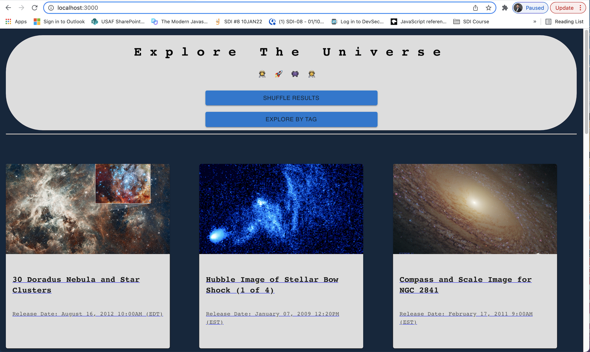
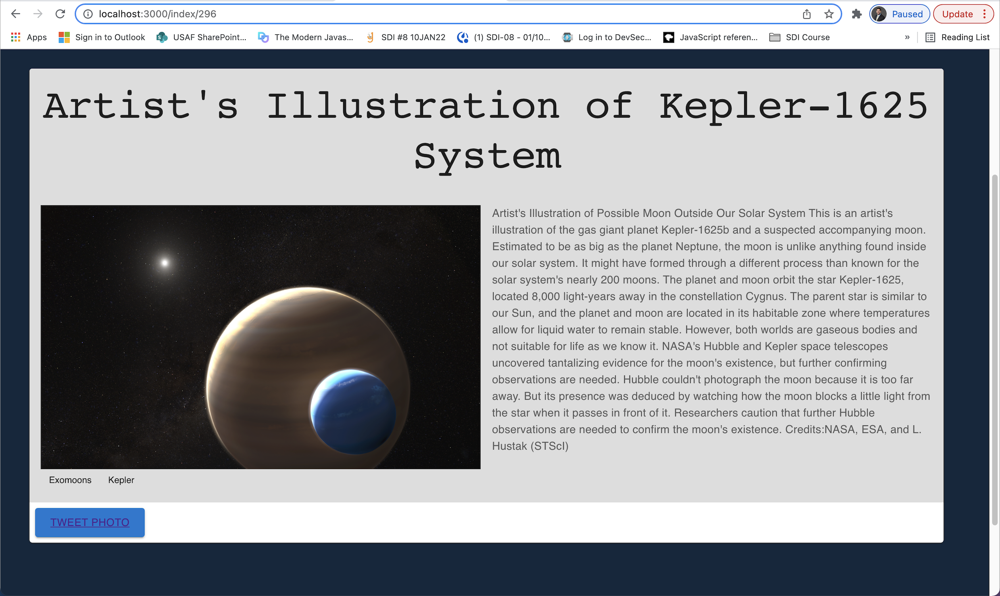
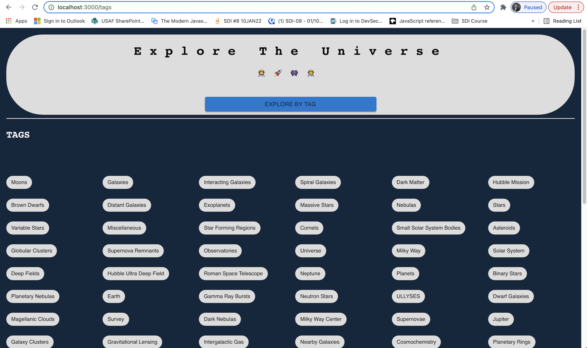
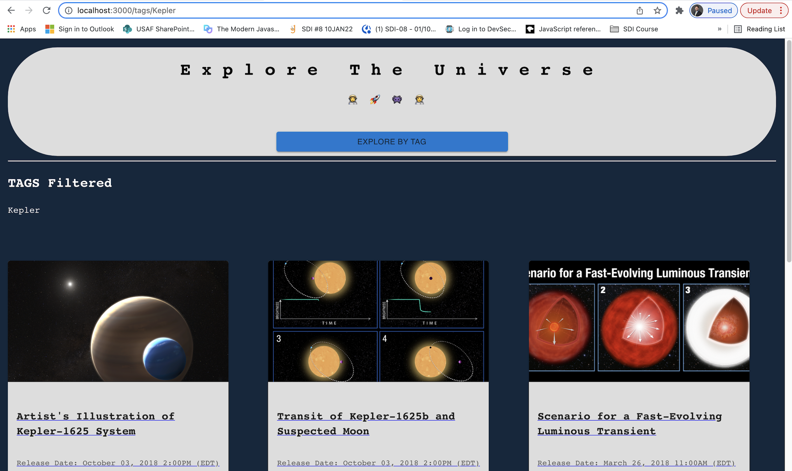

https://github.com/BrianLeal/explore-the-universe
# Explore the Universe
## Overview
With Explore the Universe, students and teachers can explore the wonders of the cosmos. Using the Hubble's API, users can review over 2000 spectacular photos. Clicking on the photo reveals additional information and stories about the image.
On the home page, explorers are greeted with 12 stunning photos from the database. These 12 photos are randomly chosen, so explorers will never know what they might discover!
For those who are looking for a more specific photo, Explore the Universe can sort by Tags. This way, explorers can research exactly what they need.
## Table of Contents
[Description](#Description)

[Installation](#Installation)

[Usage](#Usage)

[ProjectPlan](#ProjectManagementPlan)

[ProjectPlan](#ProjectManagementPlan)

# Description
Explore the Universe runs with the following stack:

Front End: React

UI: Material UI

Back End: Node


# Installation
If you are an instructor, you can customize the learning experience by downloading our source code.
DEPENDENCIES: Enusure you have Node JS 17 or higher

1- Clone the repo to your local server
``` git clone https://github.com/BrianLeal/explore-the-universe```

2- Navigate to the root directory for the project
``` cd explore-the-universe```

3- Install the required dependencies 
```npm install```

4- Start the server
```npm start```

# Usage
Once the server is started, users can access the site by going to http://localhost:3000





# Presentation
What did we learn?
    -The importance of remaining organized
    -Scrum practices = time management
    
What did you learn?
    -Brian: 
        - Google is your friend! Understanding how to ask the right questions was vital to finding solutions.
        - With larger projects, stubbing/psuedo-code is vital to app integrity.

What went well/did not go well?
    - Teamwork/task allocation allowed us to remain effective and maintain our timeline
    - TDD really slowed us down and stunted our creativity in coding

What did you contribute?
    -Brian: Conveyed final product vision. / Develop user requirements / Designed and implemented User Interface / optimized application performance

    -Justin: MUI, project backbone, functionality

What are 1 or 2 interesting decisions you made in the project?
    -Brian: Creating the 'shuffle' theme, so that the project could foster genuine curiousity in exploring the universe
        
Provide compelling rationale for decisions
    - The decision to pivot from a search functionality to a tags based concept really helped us stay true to our core idea of exploring, and allowed for deeper dives into the ideas you has happened to run into.

What was your hardest challenge?
    What was it, why couldn’t you get it to work at first?
    What problem solving techniques did you use to help get you past them?

        - 

What would you do if you had more time?
    - 

What aspect of the project are you most proud of?

Did your team adhere to your preparation / planning?

Does your project resemble your wireframes?


# Project Management Plan
## Meeting Minutes
[Google Docs](https://docs.google.com/document/d/1MTWJ4a-gqoguZJ0wuAttwM-KTt9vggshvB8eIYDHdnE/edit?usp=sharing)

## Kick Off
### MVP
- Display photo thumbnails of all images.
- Search function to narrow image requests.
- Clicking on the image displays more detailed information.
- Must be responsive.


### User Stories
As a ... I want to... So that...
1. As a student, I want to see multiple photos at once (on my laptop), so that I can dig into additional details on the images that are the most relevant.
2. As a student, I want to click on an image and see more detailed information so I can learn about space.
3. As a student, I want to see all the images on my phone, so I can marvel in what humanity has been able to capture.
4. As a professor, I want to use tags to only see relevent photos so I can use the photos in a powerpoint.
5. As a professor, I want to be able to share the link to a detailed photo so I can share information to my students.
6. As a student, I only want relevant photos loaded to my device at a time to save on bandwith. 
7. As a student, I want to be able to filter photos based on tags so I can only see only information that will help me complete an assignment.
8. As a student, I want to be able to tweet the details of an image, so that I can share with classmates. 
9. As a professor, I want to easily change the API base URL in case the database moves in the future.
10. As a student, I want to click a button to return back to the search page, so that I can access previous results.
11. As a student, I want to see the title of each photo on the home page, so that I have a better idea of whether I want to see more detailed information on.
12. As a student, I want to see associated tags for each photo on the detailed view, so that I can dig deeper into a niche within my assignment.
13. As a student, I want to see a detailed description of a photo after I click on it, so that I can absorb as much available information as possible.
14. As a student, I want the page to still load if the photo data becomes corrupted so that I can still the additional information attached to that photo.
15. As a professor, I want to see a small dataset on the homepage, so that I'm not overwhelmed by options. 

### Wireframes
[Home](https://wireframe.cc/Uk0EAA)

[Detailed](https://wireframe.cc/KpO0Ws)

### API Docs and Modules
[hubble site API](https://awesomeopensource.com/project/Spectre-ak/api-hubblesite)

[Spring](https://react-spring.io/hooks/use-springs)

[MUI](https://mui.com/getting-started/installation/)